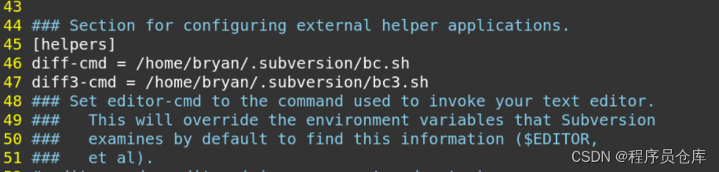

# Ubuntu系统将Beyond Compare配置为svn diff工具

相对于 SVN 默认的 diff 工具，我更习惯于用 beyond compare 做差异对比。通过更改 svn 的配置文件，即可将 beyond compare 作为 svn diff 的默认工具。

安装了 svn 之后，会在 home 目录下生成一个名为 .subversion 的隐藏目录。

首先，在 .subversion 目录中创建 bc.sh 脚本文件，内容如下：
```bash
#!/bin/sh
 
bcompare --left ${6} --right ${7} -title1="${3}" -title2="${5}" &
 
exit 0
```

然后，在 .subversion 目录中创建 bc.sh 脚本文件，内容如下：

```bash
#!/bin/sh
 
bcompare --older ${9} --mine ${10} --yours ${11} &
 
exit 0
```

最后，修改 .subversion 目录中的 config 文件，在 [helpers] 下面添加 diff-cmd 和 diff3-cmd 的定义。

```bash
diff-cmd = /home/bryan/.subversion/bc.sh
diff3-cmd = /home/bryan/.subversion/bc3.sh
```

修改完成后，效果如图：



配置完成后，再执行 svn diff 指令就会调用 beyond compare 进行文件对比了。 