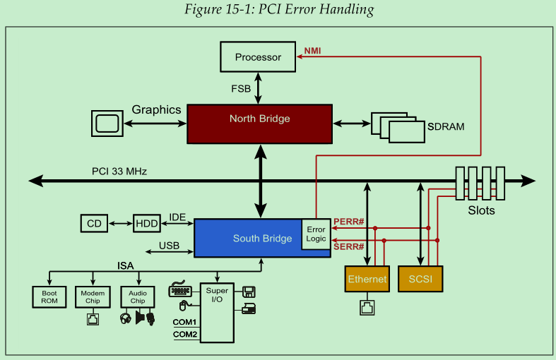

## 背景

PCIe 一个很大的特点就是软件兼容 PCI，所以在 PCIe 配置空间（configuration space）中保留了 PCI 的寄存器。 

在 PCI 协议中，当传输过程中检测到错误时，设备会首先更新配置空间中的 Status Register，然后根据错误类型使用`PERR#`或者`SERR#`信号向总线上的其他设备报告错误情况。`PERR#`（Parity Error）代表数据传输过程中出现了校验错误，通常可以恢复的。`SERR#`（System Error）代表无法恢复的严重错误。这两种类型的错误可以按照如下归类：

- 普通的数据校验错误 -- 使用`PERR#`信号
- 多任务事务传输时发生的数据校验错误 -- 使用`SERR#`信号
- 地址或命令校验出错 -- 使用`SERR#`信号
- 其他类型错误（设备相关）-- 使用`SERR#`信号

错误的处理方式可能包含硬件或者软件。例如，读取内存的时候发生数据校验错误，那么在确定内存数据没有因为这次失败的访问而导致损坏的前提下，硬件在发现错误之后重新读一次就可以了。

从上图中可以看出，所有 PCI 设备的`PERR#`和`SERR#`信号都被接到了南桥上，然后南桥通过 NMI (Non-Maskable Interrupt) 通知将错误情况通知 CPU。早期的消费级电脑上没有投入太多的成本在这类的错误处理上，所以在受到错误通知后，系统直接停止并进入蓝屏界面（BSOD，Blue Screen Of Death）。

PCI-X 总线也是使用`PERR#`和`SERR#`信号，但它根据设备特定的错误处理程序是否存在，制定了对应的错误处理规则。如果没有对应的错误处理程序，那么所有的校验错误都会使用`SERR#`信号上报。

后来的 PCI-X 2.0 主要面向企业级应用场景。这些场景下的硬件资源更丰富，所以 PCI-X 2.0 协议开始支持ECC（Error-Correcting Code）校验。通过ECC，硬件可以在传输过程中自动纠正1 bit的错误。

最后，PCIe 协议为了兼容 PCI 和 PCI-X 协议，在配置空间中保留的错误状态位（Error Status Bit）。所以，基于 PCI 或者 PCI-X 的传统软件也能在不修改的情况下，操作 PCIe 设备。

## 错误定义

协议中定义了四个通用名词：

- Error Detection：即判定错误是否存在的过程。对于设备来说，发现错误是一个内部事件，例如接收到了一个坏的数据包，或者从另一个设备收到了一个标记着错误的数据包（例如 poisoned packet）。
- Error Logging：根据检测到的错误类型，设置设备配置空间中对应的寄存器，以便于错误处理程序之后使用。
- Error Reporting：向系统发出通知，告诉它：”现在出错了“。在使能了 Error Message 发送功能的情况下，设备检测到错误之后，向 Root Complex 发送Error Message，Root Complex 接收到 Error Message 之后，向系统（CPU）发出中断。 
- Error Signaling：一个设备向另一个设备告知”错误“的过程，可以通过以下方式：
  - 发送 Error Message
  - 发送一个 Completion 包，并把它的状态设置为 UR（Unsupported Request）或者 CA（Completer Abort）
  - 发送一个污染的 TLP（poisoning a TLP），通常这种方法被称为错误转发（Error Forwarding）。

## 错误报告（Error Reporting）

PCIe 有两个层级的错误报告机制，一种是基础错误报告（baseline error report），是所有设备都必须支持的，另一种是高级错误报告（AER，Advanced Error Report），不强制要求支持。高级错误处理（AER）通过配置空间中的 Advanced Error Reporting Capability 提供了一组寄存器，记录了更多的错误细节。

### 基础错误报告

与基础错误报告机制相关的寄存器有两组：

- PCI-Compatible Register：这组寄存器是用来与 PCI 协议进行兼容的。PCIe 错误会被映射为 PCI-compatible 类型的错误，供传统的 PCI 程序使用。
- PCI Express Capability Registers：这组寄存器是 PCIe 协议特有的，可以提供更多的错误相关信息。

### 高级错误报告（AER）

AER 机制提供了更多的错误相关信息，与该机制相关的寄存器保存在配置空间的 Extended Configuration Space 部分。

## 错误类型

根据“错误能否被硬件纠正”，可以将错误分为 Correctable 和 Uncorrectable。对于 Uncorrectable 类型的错误，根据“能否被软件修复”，可以再被细分为 Non-fatal 和 Fatal。

- Correctable errors：能够被硬件自动修复
- Uncorrectable errors：无法被硬件自动修复
  - Non-fatal：由设备相关的软件处理，此时链路正常，有可能在不丢失数据的情况下修复。
  - Fatal：由系统软件处理，此时链路或者设备无法正常工作，基本不可能在不丢失数据的情况下修复。