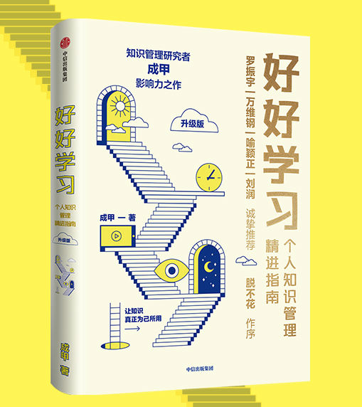

## 书籍简介

- 作者：成甲
- 出版：中信出版集团股份有限公司
- 班次：2022年7月第2版
- 印次：2022年7月第1次印刷

## 前言

- 要解决的现状

  当下，很多人都在热情追逐知识的获取，把获得当做重点。但是，后续的管理和实践才是将知识效益最大化的关键。

  互联网时代，获取信息非常容易，但人们急需解决的是：如何利用信息改变个人的思考和行为，最终将信息内化为知识。

- 本书的目的

  讲述学习的方法，知识管理的方法，最终希望能够帮助更多人的生活和行为发生改变。

> 反思：
>
> 在日常生活中，我们经常发现之前读过的文章和书都在不经意间被遗忘，感觉就像白白浪费了时间和精力。在本书中，作者引用/提出了一个观念：“只有改变你行动和思维的信息才是知识。” 所以，我们不应该盲目的追求数量，而是要追求自身的改变。哪怕我们只看了书中的一小部分，但能够坚持实践，改善我们的行为，那就是极大的收获。
>
> 作者在书中提到了“临界知识”，这和刘润《底层逻辑》中提到的“底层逻辑”、查理芒格《穷查理宝典》中提到的“普世智慧”类似，都是一种贴近本质的、可以跨领域应用的基本规律。这种规律，掌握一条就可以处理多种具体问题，有点“事半功倍”的意思。但是，想要掌握这种规律也不是一朝一夕就能达到的。所以，在学习“临界知识”的道路上，要少些急于求成的功利心，多多反思，多多实践。

## 知识管理与认知优势

- 现状形式分析

  20 世纪 90 年代到 2000 年的时候，**知识数量**可以构建认知优势。在这个阶段，大学生、学院派很受重视，以咨询企业、广告公司等为代表的的知识密集型行业蓬勃发展。

  2000年到现在，**知识的获取速度**可以构建认知优势。在这个阶段，谁能比别人快速的获取前沿知识，谁就更有可能成功。例如校内网、美团、微博等大型公司的成功，就是因为他们最早、最快的将国外的 Facebook、Twitter、Groupon 公司的模式搬到了国内。

  从现在开始，我们基本开始步入依靠**知识深度**构造认知优势的时代。由于互联网的告诉发展，大家基本上都能快速的了解国际上最领先的知识。在知识数量和获取知识速度相同的前提下，对知识掌握的深度就变成了成功的关键。

  知识管理的核心不是对知识进行搜集、分类、保存，而是通过管理知识提升我们的认知深度，进而改变我们的行为模式。

- 如何提升认知深度

  - 什么是深度认知

    分析问题时，能跳出问题本身，思考更普遍的情况。

    寻求答案的时候，能够根据理由的可信度判断是否接收这个结论。

  - 什么是临界知识

    经过了更为广泛、长期的验证，在更普遍的领域具有指导意义和应用价值。

    掌握临界知识，便能开启学习的“少即是多”、“四两拨千斤”模式，从而极大提高学习效率。

  - 如何提升认知深度？
  
    学会透过现象看本质

- 为什么大多数人的学习层次上不去
  - 原因：只注重提升`技术效率`，而不注重`认知效率`。
  - 技术效率
    - 概念：不断掌握应对**具体**工作场景和问题的方法
    - 弊端：遇到每个新问题，都需要学习新知识
  - 认知效率
    - 概念：了解问题本质，了解解决方案的底层规律，认清楚问题表象背后的实质。其实就是学习临界知识。
    - 优势：20%的知识解决80%的问题；一通百通

- 到底哪些知识值得学
  - 以斜杠青年和马斯克的例子，得出结论：斜杠是提升认知深度的结果，而不是追求多元的结果。
